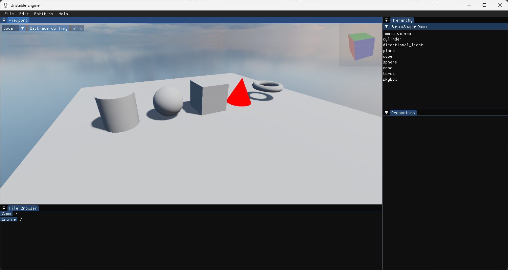
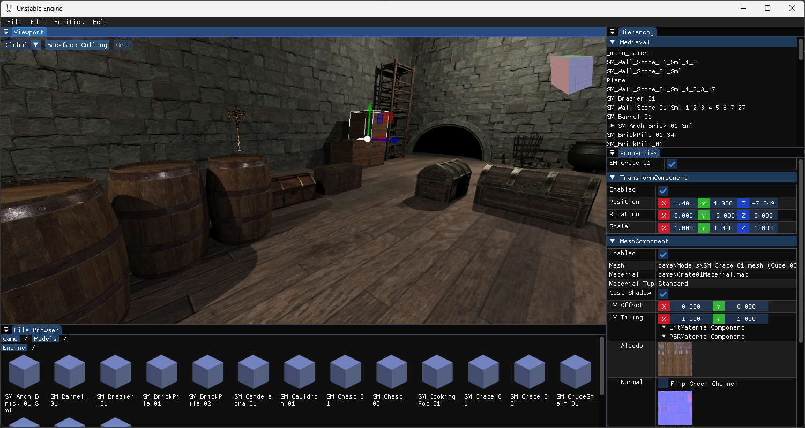
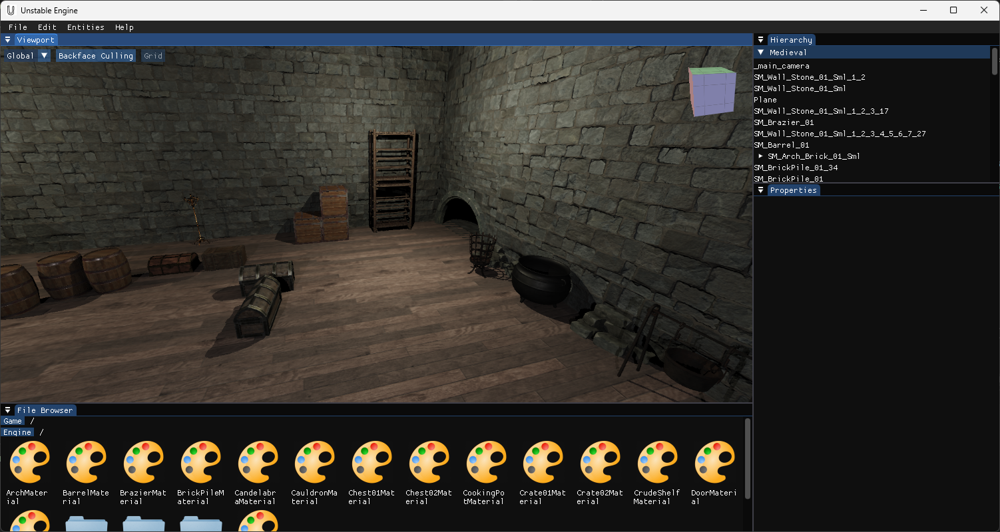

# Unstable Engine
A game engine made for study purposes based on SDL and OpenGL.

Features:
- Game Editor: scene editor, file browser, hierarchy/outliner, properties
- Data asset files: scenes, entities, materials, etc
- 3D model loading
- 2D images, text and buttons
- PBR materials
- Custom GLSL shader based materials
- Shadow map
- Windows and Android platforms
- Skybox with IBL
- Keyboard, mouse and joystick inputs

